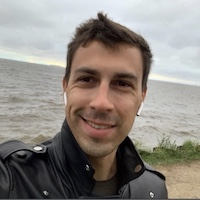

CV

# Maksim Baranov
***



I have been studying computer programming for several months now. It gives me pleasure, I would like to devote my life to it. My goal is to become a professional web developer.

## Personal info

- **Address:** St. Petersburg, Russian Federation;
- **Phone:** +7 921 303-06-86;
- **E-mail:** oooinfo@mail.ru.

## Soft skills
- **Communication:** Advanced;
- **Problem-solving:** Advanced;
- **Time-management:** Very good.

## Hard skills
- **Html:** Good;
- **Css:** Good;
- **Git:** Basic;
- **JavaScript:** Basic.

## Experience 
Designed several landing pages for my employer using a website builder. 
Created a few webpage slicing of education HTML website templates.

## Education
- Specialist Degree in Law (St. Peterburg State University of Economics, 2010–2016);
- СЕО (Online Course, 2018);
- Yandex.Direct (Online Course, 2019);
- Html, Css, Javascript (learning on my own since this year).

## Languges
- **Russian:** Native Proficiency;
- **English:** Basic.

## Example of my code
This code will calculate the sum of all numbers that occur from 1 to the number entered into the function.
```
function testWhile(a) {
    var x=0;
    var i=1;
    while(i<=a){
       if(i%2===0) {
           x=x+i;}
           i++;
    }
    return x;
}
```
